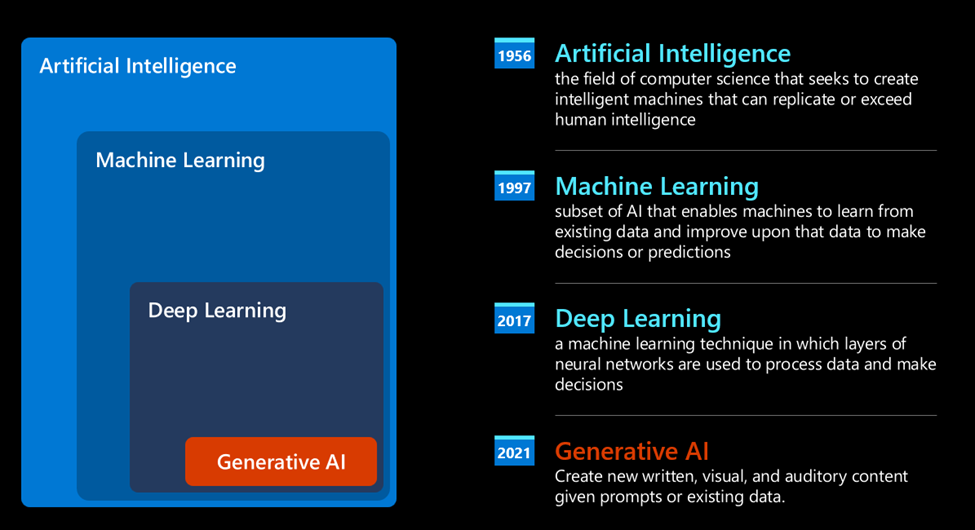

# Generative AI for beginners

based on the course in https://microsoft.github.io/generative-ai-for-beginners/#/

# 1. Introduction to Generative AI and LLMs

The following figure shows an overview of the role of Generative AI in the machine learning category.

The following figure shows an example of tokenization to convert text to numbers.

## How can our startup leverage LLMs?

LLM is _generating a text from scratch, starting from a textual input, written in natural language._

- Input -> prompt
- Output -> completion

# 2. Exploring and comparing different LLMs

## Different types of LLMs

- **Audio and speech recognition** - Whisper
- **Image generation** - DALL-E, Midjourney
- **Text generation** - GPT

### foundation versus LLMs

Foundation Model is an AI model that follows some criteria, such as

- trained using unsupervised of self-supervised learning
- very large
- normally intended to serve as a 'foundation' for other models

### open-source versus proprietary

- _Open-source_ models are models that are made available to the public and can be used by anyone.
  - allowed to be inspected, modified, and customized
  - not always optimized for production
  - may not be maintained long term or may not be updated with the latest research (because of funding)
  - examples are [Alpaca](), [Bloom](), and [LLaMA]()
- _Proprietary_ models are models owned by a company and are not made available to the public.
  - **not allowed** to be inspected, modified, or customized
  - often optimized for production
  - not always for free
  - user do not have control over the data that is used to train the model
  - examples include [OpenAI models](), [Google Bard](), or [Claude 2]()

### embedding versus image-generation versus text (code) generation

This is categorized by the output LLMs generate.

- _Embedding_ models are models that can convert text into a numerical form.
  

  - make it easier for machines to understand the relationships between words or sentences
  - often used for transfer learning - a model is built for a surrogate task for which there's an abundance of data, and then the model weights (embeddings) are re-used for other downstream tasks
  - examples include [OpenAI embeddings]()

- _Image generation_ models are models that generate images
  

  - often used for image editing, image synthesis, and image translation
  - often trained on large datasets of images (e.g., [LAION-5B]())
  - used to generate new images or to edit existing images with inpainting, super-resolution, and colorization
  - examples include [DALL-E-3](), [Stable Diffusion models]()

- _Text and code generation_ models are models that generate text or code
  

  - often used for text summarization, translation, and question answering
  - often trained on large datasets of text (e.g., [BookCorpus]()) or of code (e.g., [CodeParrot]())

-
