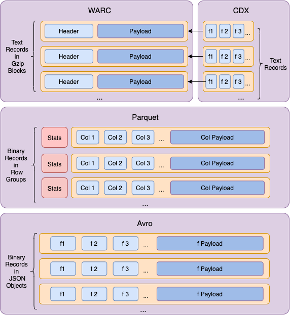
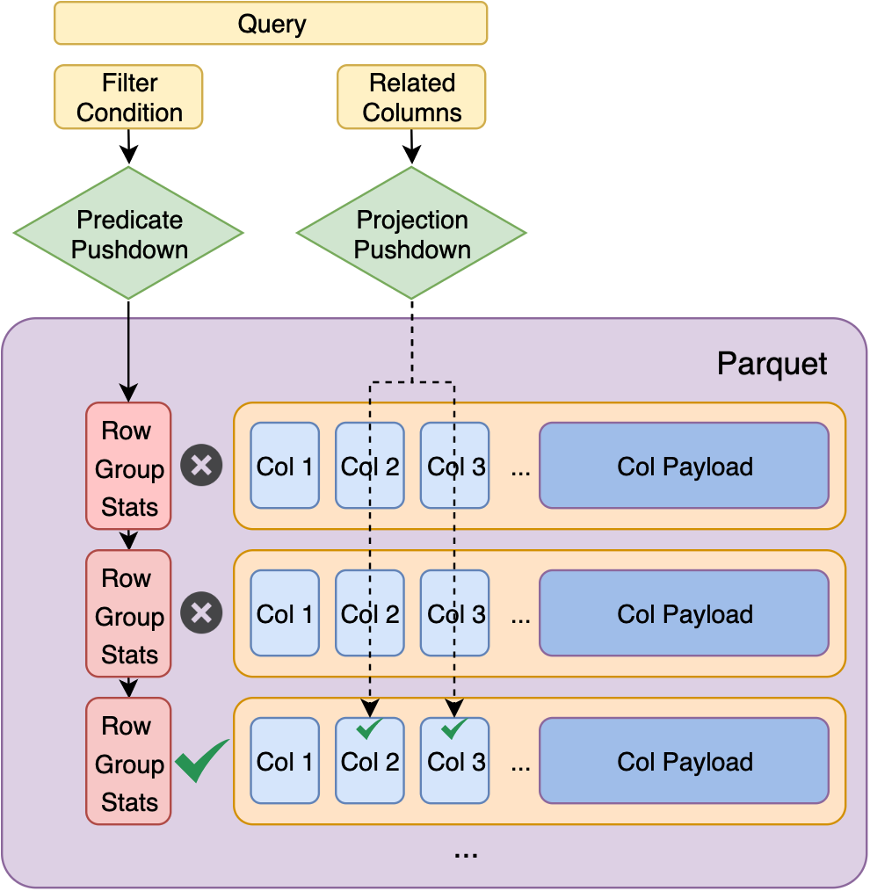

# (2020) The Case for Alternative Web Archival Formats to Expedite the Data-To-Insight Cycle

Xinyue Wang, Zhiwu Xie

## Highlights

+ The WARC format performs bad for batch processing workload due to its *data structure, encoding, and addressing method.*
+ Better performance can be easily achieved by reformatting WARC files into *Parquet* or *Avro* formats.

**Figure 1.** Comparing WARC-CDX, Parquet, and Avro

**Figure 2.** Use predicate pushdown and projection pushdown to skip reading unnecessary row groups or columns in Parquet data
